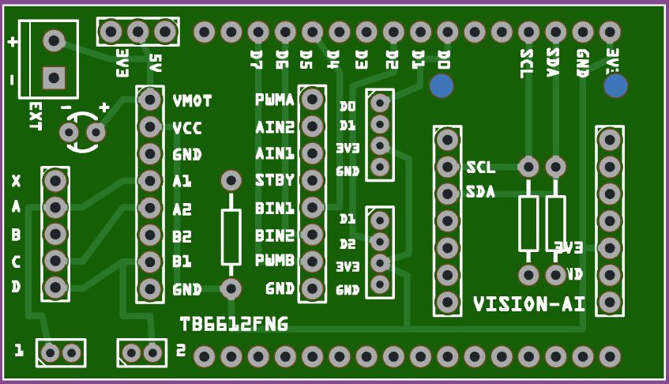

# T-SIM Motor shield (ESP32 / ESP32-S3)

This repository contains a clean, deterministic GPIO + I2C baseline used to validate pinout consistency and external bus behavior across LilyGO T-SIM boards when used with a generic **T-SIM Motor driver Shield**, to be used by either a Stepper Motor or two DC motors using the **TB6612FNG** Motor Driver.

The shield also provides a male header connector for the XIAO slot of the Seeed Grove Vision AI V2 board.

The focus of this development is hardware correctness and repeatability, not application logic. It provides a proven foundation for later integration of actuators (relays, DC or stepper motors) and external I2C peripherals (sensors, expanders, AI modules).

The same firmware can operate the TB6612FNG in **two distinct roles**, selected at compile time:

* **Stepper mode** – drive a 28BYJ-48 as a *bipolar (2-coil) stepper* with the red wire disconnected
* **DC motor mode** – drive **two independent DC motors** (Motor A and Motor B)

In addition, two GPIOs (**D0** and **D1**) are reserved for **status LEDs** provided a GPIO Grove connector, supplying access to D0/D1 and D1/D2 for additional purposes.

The goal of this project is to provide a **clear, hardware-faithful reference** for testing motors, wiring, PWM behavior, direction control, and basic runtime liveness on ESP32-S3 hardware.

---

## Custom development PCB

This project was developed and tested on a **custom PCB** that integrates:

* Seeed XIAO ESP32-S3
* TB6612FNG motor driver
* Dedicated motor connectors
* Common ground and power routing for VM / VCC




---

## Hardware

* **MCU:** Seeed XIAO ESP32-S3 (or compatible ESP32-S3 board)
* **Motor driver:** TB6612FNG dual H-bridge
* **Motor option A:** 28BYJ-48 stepper wired in bipolar-like mode
* **Motor option B:** Two DC motors
* **Pull-down resistors I2C:** 2x 4k7 (optional)
* **Pull-up resistor STBY:** 1x 10k (mandatory)
* **5-pin connector:** 1x JST-XH, RM2,5mm for steppermotor like 28BYJ-48
* **2-pin connector:** 2x JST-PH, RM2,0mm for DC motors
* **Jumper:** Jumper Cap 2 Pins 2,54mm (VMOT selector)

|Jumper |VMotor (VMOT)|
|---|---|
| 1-2 | 3V3 from T-SIM|
| 2-3 | DC5/VBAT from T-SIM|
| none | External power (screw connector EXT)|

### Power notes

* **VM (motor supply):** connect to your motor supply (commonly 5 V for small motors)
* **VCC (logic):** 3.3 V from the ESP32-S3
* **GND:** all grounds must be common
* **STBY:** assumed **wired to 3.3 V** (driver always enabled)

---

## Mode selection

Mode is selected at compile time in `src/main.cpp`:

```cpp
#define MODE_STEPPER 1
#define MODE_DC      2
#define MODE MODE_STEPPER   // change to MODE_DC for DC motor mode
```

* **MODE_STEPPER**

  * Runs a 28BYJ-48 as a 2-coil stepper at a fixed speed
* **MODE_DC**

  * Turns the TB6612FNG into a dual DC motor driver controlled via Serial

---

## Status LEDs (D0 / D1)

Two GPIOs are intentionally reserved for additional purposes;

| Signal | Board pin | Description         |
| -----: | --------- | ------------------- |
|   LED0 | D0        | Heartbeat indicator |
|   LED1 | D1        | Inverted heartbeat  |

### LED behavior

* D0 and D1 blink **alternately** (one on, one off)
* Blink timing is fixed in firmware (≈250 ms)
* LED updates are non-blocking and continue:

  * while the stepper motor is running
  * while DC motors are active
  * inside timing loops and delays

This provides an immediate visual indication that:

* the MCU has booted correctly
* the main loop is alive
* timing-sensitive motor control code is not stalling execution

---

## TB6612FNG pinout (ESP32-S3 GPIO)

| TB6612FNG pin | Function           | ESP32-S3 GPIO  |
| ------------- | ------------------ | -------------- |
| PWMA          | PWM speed Bridge A | GPIO 9         |
| AIN1          | Direction A        | GPIO 11        |
| AIN2          | Direction A        | GPIO 10        |
| PWMB          | PWM speed Bridge B | GPIO 14        |
| BIN1          | Direction B        | GPIO 13        |
| BIN2          | Direction B        | GPIO 12        |
| STBY          | Enable             | Wired to 3.3 V |

PWM is generated using **ESP32 LEDC**:

* Frequency: **20 kHz** (quiet)
* Resolution: **8-bit** (0…255)

---

## 28BYJ-48 “bipolar” mode (red disconnected)

The classic **28BYJ-48** is a 5-wire *unipolar* stepper motor. To use it with an H-bridge:

1. **Disconnect the red wire** (do not connect it to VM, VCC, or GND)
2. Use the remaining four wires as **two independent coils**
3. Drive each coil with one TB6612FNG bridge

### Confirmed working coil pairing

| Bridge | Coil wires    |
| ------ | ------------- |
| A      | Orange + Pink |
| B      | Yellow + Blue |

* Red wire: **disconnected**
* This pairing provided **strong torque in both directions** during testing

---

## Wiring table (reference)

| Connector | Color  | Winding | Channel | Pin |
| --------: | ------ | ------- | ------- | --- |
|         X | Red    | –       | –       | –   |
|         A | Orange | A1      | CH1 (−) | P4  |
|         B | Yellow | B1      | CH2 (−) | P6  |
|         C | Pink   | A2      | CH1 (+) | P5  |
|         D | Blue   | B2      | CH2 (+) | P7  |

> **Note:** Swapping the two wires of *one* bridge simply flips the direction of that coil.

---

## Recommended stepper speed range

Based on testing with the 28BYJ-48:

* **Best torque:** 200–400 steps/s
* Above ~400 steps/s the motor tends to **slip or lose torque**

---

## Stepper mode behavior

Stepper mode uses **full-step, 2-phase-ON driving**.

### Step sequence (A, B)

1. A+, B+
2. A−, B+
3. A−, B−
4. A+, B−

### Implementation details

* Fixed speed via `FIXED_STEPS_PER_SEC` (default: **400**)
* Direction alternates automatically:

  * Forward for `RUN_DIR_MS`
  * Short coast (`COAST_MS`)
  * Reverse for `RUN_DIR_MS`

---

## Stepper mode serial controls

While the stepper is running, you can adjust coil polarity in software:

* **`a`** → toggle `FLIP_COIL_A`
* **`b`** → toggle `FLIP_COIL_B`
* **`r`** → reset both flips

This is useful if the motor runs backwards or stepping feels rough after rewiring.

---

## DC motor mode behavior

In DC mode, the TB6612FNG is used as **two independent DC motor channels**:

* **Motor A:** AIN1 / AIN2 + PWMA
* **Motor B:** BIN1 / BIN2 + PWMB

---

## DC mode serial commands

Open the Serial Monitor at **115200 baud**, newline enabled.

Commands:

* `A <speed>` → Motor A speed (**−255 … 255**)

  * `A 200`  → forward
  * `A -150` → reverse
* `B <speed>` → Motor B speed (**−255 … 255**)
* `S` → stop both motors
* `H` → print help

---

## Recommended DC operating range

From testing:

* **Best torque band:** PWM duty **150–255**
* Below ~120 duty, torque is typically insufficient

---

## PWM limits (why 255 is the max)

The sketch uses **8-bit PWM**:

* Duty range: `0…255`
* `255` = **100% ON**

Increasing PWM resolution (e.g. 10-bit → 0…1023) gives *finer control*, but **does not exceed 100% duty**.

To increase torque beyond this, hardware changes are required:

* Higher motor supply voltage (within motor/driver specs)
* Higher current capability
* Different motor or gear ratio

---

## Quick start

1. Wire TB6612FNG power: **VM, VCC, GND, STBY**
2. Choose motor wiring:

   * **Stepper:** Orange+Pink → Bridge A, Yellow+Blue → Bridge B, red disconnected
   * **DC:** Motor A → A01/A02, Motor B → B01/B02
3. Select mode in `src/main.cpp`
4. Build and flash
5. Open Serial Monitor at **115200**

---

## Summary

This project is intended as a **clean, repeatable test harness** for:

* TB6612FNG direction logic
* ESP32-S3 LEDC PWM behavior
* 28BYJ-48 bipolar conversion
* Dual DC motor control

It is well suited for bring-up, custom PCB validation, and motor experiments before integrating into larger systems.
